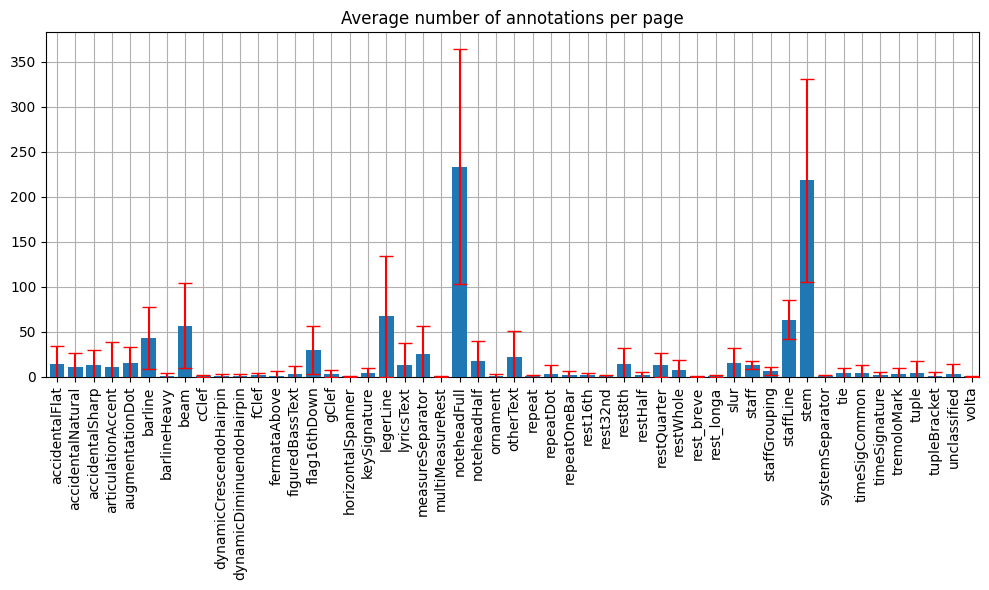
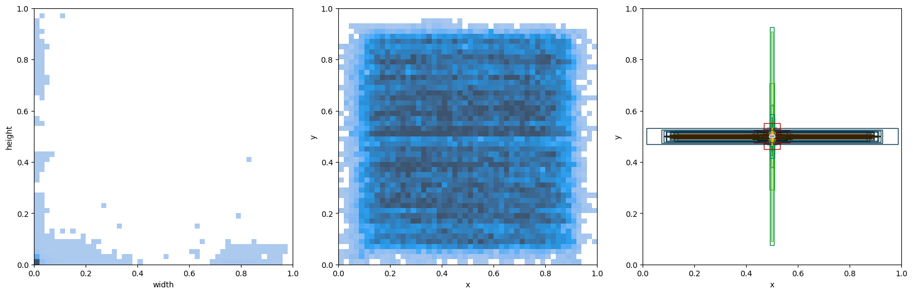

# Notehead experiments

This project is currenctly a work in progress.

## Dataset visualization

### Average number of annotations per page (with stddev)

### Heatmaps

## Image splitting

Visualization of image splitting with overlap 0.10 and 0.25.

  
  

## Outputs from multiple models combined

### Notehead + staff detection

